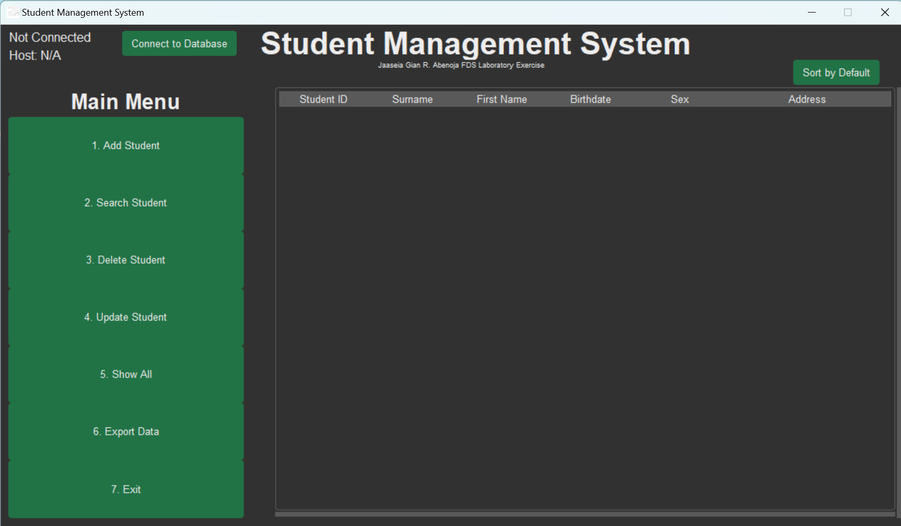
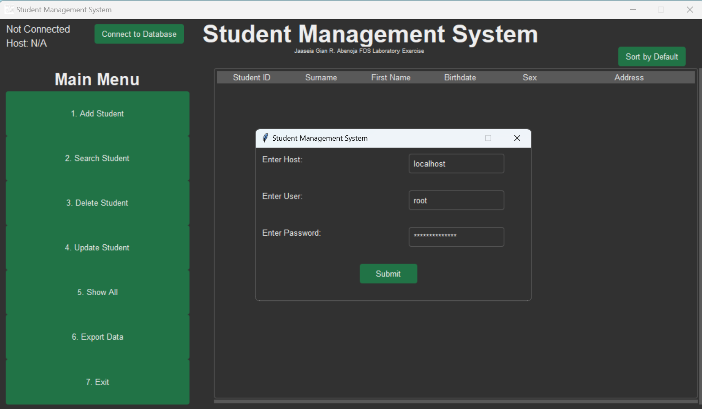
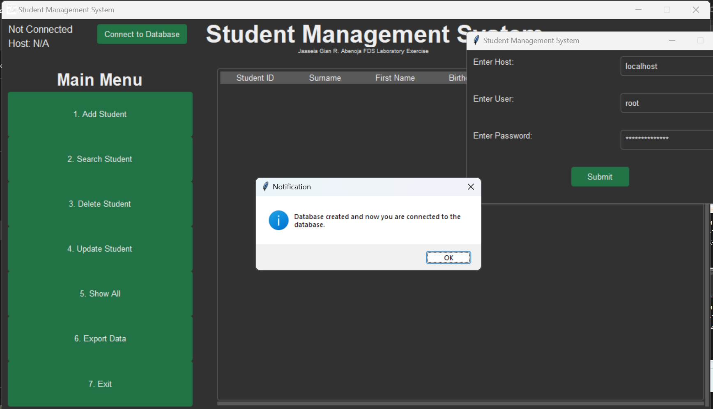

# Fundamentals of Database System Project

This project is a part of the **Fundamentals of Database System** course. It demonstrates the application of MySQL with a graphical user interface (GUI) built using `tkinter` in Python along with `PyMySql` to interact with the database.

## Table of Contents

- [Introduction](#introduction)
- [Features](#features)
- [Setup and Installation](#setup-and-installation)
- [Usage](#usage)
- [Screenshots](#screenshots)
- [Contributing](#contributing)
- [License](#license)

## Introduction

The purpose of this project is to showcase the integration of MySQL with a GUI application. The project allows users to perform basic database operations like Create, Read, Update, and Delete (CRUD) through a user-friendly interface.

## Features

- **Create:** Add new records to the database.
- **Read:** View and search records from the database.
- **Update:** Modify existing records.
- **Delete:** Remove records from the database.
- **Sort Options:** Sort records by Surname (A-Z), Surname (Z-A), or Default (ID).
- **Export:** Export data to a CSV file.
- **User Interface:** A simple and intuitive GUI built using tkinter.

## Setup and Installation

### Prerequisites

- Python 3.11.7
- MySQL Server
- `PyMySql` package
- `tkinter` package (usually comes pre-installed with Python)

### Installation

1. Clone the repository:
    ```sh
    git clone https://github.com/your-username/fds-project.git
    ```

2. Navigate to the project directory:
    ```sh
    cd fds-project
    ```

3. Install the required packages:
    ```sh
    pip install PyMySql
    ```

## Usage

### How It Works

The application works by connecting to a MySQL server and upon first connection, it will automatically create a database named `studentmanagementsystem1` on that server. Here are the steps:

1. **Connect to MySQL Server:** 
    - Click on the "Connect to Database" button.
    - Enter the MySQL server credentials (host, user, and password).
    - The application will attempt to connect to the MySQL server with these credentials.
    - If successful, it will create a database named `studentmanagementsystem1` if it doesn't already exist.
    - It then switches to use this database.

2. **Database and Table Creation:**
    - If the database is created successfully or already exists, the application will then check for the existence of the `studentdata1` table.
    - If the table does not exist, it will be created with the specified schema containing fields like `studid`, `surname`, `firstname`, `birthdate`, `sex`, and `address`.

3. **Subsequent Usage:**
    - For subsequent uses, when you connect to the database, the application will automatically use the existing `studentmanagementsystem1` database and the `studentdata1` table without needing to recreate them.

4. **Operations:**
    - **Add Student:** Add new student records to the database.
    - **Search Student:** Search for student records based on different criteria.
    - **Update Student:** Update existing student records.
    - **Delete Student:** Remove student records from the database.
    - **Show All Students:** Display all student records.
    - **Export Data:** Export all student records to a CSV file.
    - **Sort Options:** Sort the displayed records by Surname (A-Z), Surname (Z-A), or Default (ID).

### Running the Application

1. Run the main application:
    ```sh
    python main.py
    ```

2. Use the interface to connect to the database by clicking on the "Connect to Database" button.

3. Add, search, update, delete, or view all student records using the respective buttons.

4. Sort the student records using the sort options:
    - Select "Sort by" to choose sorting options.
    - Sort by "Surname (A-Z)".
    - Sort by "Surname (Z-A)".
    - Sort by "Default (ID)".

5. Export student data to a CSV file by clicking on the "Export Data" button.

## Screenshots

#### Home Screen 


#### Connect to database screen



#### Show All / View Students Screen


#### Add Student Screen


#### Search Student Screen


#### Delete Student Screen


#### Update Student Screen


## Contributing

If you wish to contribute to this project, please create a pull request or open an issue with a detailed description of the changes.

## License

This project is licensed under the MIT License.
